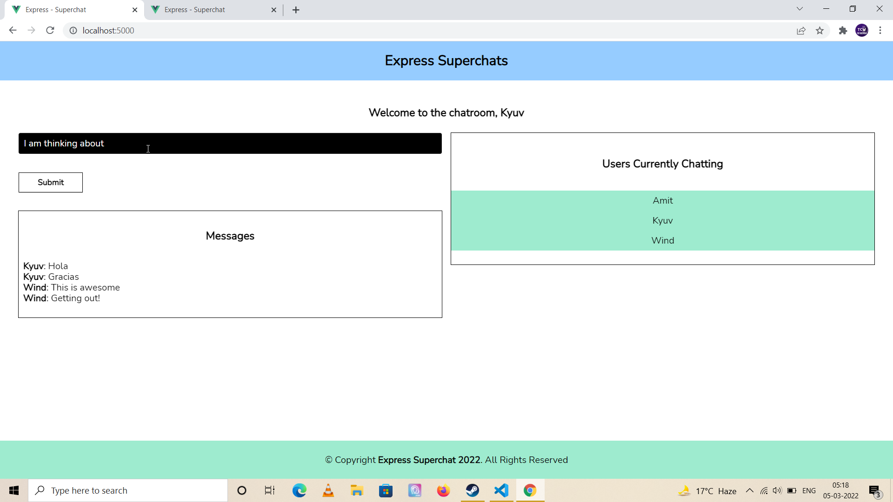
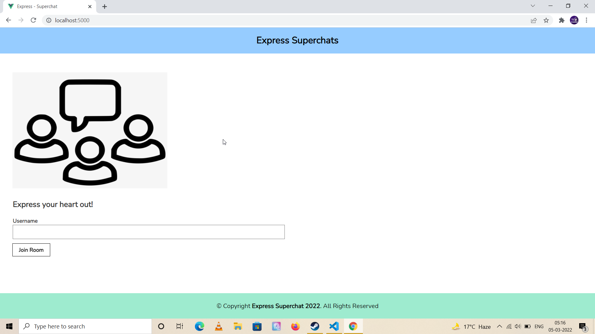

# Chat Groups using Express, Vue, Socket IO, MongoDB, Tailwind CSS and Vuex


## Project Briefing

This is a chat application created in Express, Jquery and Tachyons CSS. It is the second chat based application I've worked on in the past week. This is different from the other app which I created in MEVN stack in a way that it does not have authentication, it does not have a complete front-end written in a modern JS framework. Instead, Jquery has been used to write front-end socket functions to interact with back-end socket events.

The project is inspired by a similar project which I came across in a Node and Express course by Brad Traversy.

## Built With

* [Express](https://expressjs.com/)
* [Socket IO](https://socket.io/)
* [Tachyons](https://tachyons.io/)
* [Jquery](https://jquery.com//)

## Authors

* **Amit Prafulla (APFirebolt)** - (http://amitprafull.com/)

## Project setup

Simply install node modules for backend and run the development script. At the time of writing no deployment script is available for this project.

```
npm install
npm run dev
```

## Project Updates/Future Requirements

- Deployment scripts to be added.
- Scope for minor UI updates is there.

## Project Screenshots

Please find some of the screenshots of the application.



Homepage of the application.


